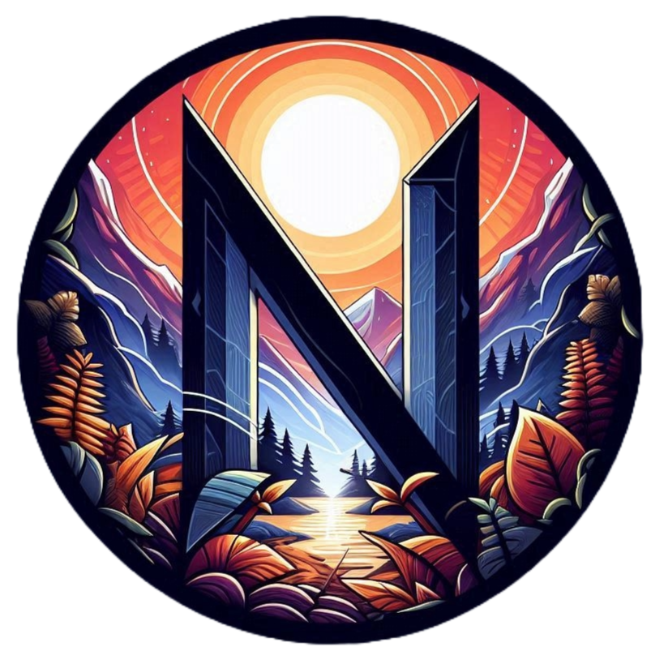

<p align="center">
  <a href="https://nelfix-production.up.railway.app">
  
  </a>
</p>

## Description

Nelfix adalah platform streaming film yang dirancang untuk memberikan pengalaman menonton yang mulus dan menyenangkan. Nelfix memungkinkan pengguna untuk menemukan, menelusuri, dan menonton berbagai film dengan mudah. Platform ini mendukung berbagai genre dan menyediakan detail lengkap tentang setiap film, termasuk judul, tahun rilis, durasi, genre, sutradara, dan harga. Nelfix sendiri adalah projek yang dibuat untuk memenuhi tugas seleksi 3 asisten laboratorium programming.

## Running the app
Projek ini dapat dijalankan secara lokal maupun melalui link deployment [berikut](https://nelfix-production.up.railway.app). Untuk menjalankan secara lokal, Anda dapat memilih menggunakan docker atau tidak. Endpoint secara lokal tersedia pada [localhost:3000](http://localhost:3000/). 

Untuk memulai menjalankan projek ini secara lokal, lakukan clone terhadap repository ini.
```bash
$ git clone https://github.com/ninoaddict/Nelfix
$ cd Nelfix
```

Selanjutnya, buat file ```.env``` pada project anda dan tambahkan environment variables sesuai dengan contoh pada ```.env.example```.
```bash
DATABASE_URL=""
SECRET=""
ACCESS_KEY_ID=""
ACCESS_KEY_SECRET=""
AWS_S3_BUCKET=""
```

### Dengan Docker
Untuk menjalankan projek ini dengan docker, pastikan docker sudah terunduh pada perangkat Anda. Jika belum, Anda dapat mengunduhnya sesuai dengan perangkat yang digunakan pada [link](https://www.docker.com/products/docker-desktop) berikut.

- Uncomment line berikut pada ```Dockerfile``` untuk menjalankan projek ini secara lokal
```bash
...
28  # COPY .env .env
...
```

- Uncomment line berikut pada ```Dockerfile``` jika anda ingin melakukan seeding terhadap database
```bash
...
15  # RUN npx prisma db seed
...
```

- Lakukan build terhadap docker image dengan menjalankan kode berikut
```bash
docker-compose build
```

- Jalankan docker container dengan menjalankan kode berikut
```bash
docker-compose run
```

- Jika ingin menghentikan program berjalan, jalankan kode berikut
```bash
docker-compose down
```

### Tanpa Docker
Untuk menjalankan projek ini tanpa docker, pastikan Node.js sudah terunduh pada perangkat Anda. Jika belum, Anda dapat mengunduhnya melalui link [berikut](https://docs.npmjs.com/downloading-and-installing-node-js-and-npm).

- Unduh semua dependencies untuk projek ini dengan menjalankan kode berikut
```bash
npm install
```
- Generate prisma client dengan menjalankan kode berikut
```bash
npx prisma generate
```
- Jika ingin melakukan seeding terhadap database, jalankan kode berikut
```bash
npx prisma db seed
```
- Lakukan build terhadap nelfix dengan kode berikut
```bash
npm run build
```
- Jalankan projek ini dengan dengan kode berikut
```bash
npm run start:prod
```

## Design Patterns
Design patterns adalah solusi terstandarisasi yang sering digunakan untuk masalah desain perangkat lunak yang umum dan berulang. Dengan menggunakan design pattern, developer dapat menghasilkan kode yang _robust_ dan _scalable_. Berikut adalah beberapa design patterns yang digunakan dalam pengembangan projek ini.

### Dependency Injection
NestJS menggunakan Dependency Injection (DI) untuk mengelola dependencies di seluruh aplikasi. Dengan DI, kita dapat menginjeksi layanan, repositori, dan dependensi lain ke dalam kelas-kelas yang membutuhkannya tanpa harus membuat instance baru secara manual. Hal ini sesuai dengan prinsip Inversion of Control (IoC) dan memudahkan pengujian serta pemeliharaan kode.

Berikut adalah contoh kode yang menggunakan dependency injection pada aplikasi ini.

```typescript
@Injectable()
export class FilmService {
  constructor(
    private readonly prisma: PrismaService,
    private readonly awsS3Service: AwsS3Service,
  ) {}

  // Metode kelas FilmService
  ...
}
```

### Decorator
Decorator adalah structural design pattern yang memungkinkan Anda menambahkan perilaku baru ke objek dengan menempatkan objek ini di dalam objek pembungkus khusus yang berisi perilaku tersebut. Dengan decorator, kita dapat menambahkan metadata atau fungsionalitas tambahan pada kelas, metode, atau properti.

Berikut adalah contoh kode yang menggunakan decorator pada aplikasi ini
```typescript
import { SetMetadata } from '@nestjs/common';
import { Role } from '@prisma/client';

export const ROLES_KEY = 'roles';
export const Roles = (...roles: Role[]) => SetMetadata(ROLES_KEY, roles);
```

Selain itu, pada Nest, decorator digunakan untuk mendeklarasikan dan mengkonfigurasi berbagai komponen aplikasi seperti controller, service, dan module.
```typescript
@Controller('users')
export class UsersController {
  constructor(private readonly usersService: UsersService) {}

  @Get()
  @UseGuards(AuthGuard, RolesGuard)
  @Roles(Role.ADMIN)
  async findAll() {
    const users: User[] = await this.usersService.findAllUser();
    const data: UserPayload[] = users.map((data: UserPayload) => {
      return {
        id: data.id,
        username: data.username,
        email: data.email,
        balance: data.balance,
      };
    });
    return {
      status: 'success',
      message: 'Get all users',
      data,
    };
  }

  // endpoints lain pada UsersController
  ...
}
```

### Singleton
Singleton adalah design pattern yang memastikan bahwa hanya ada satu instance dari sebuah kelas yang dibuat selama siklus hidup aplikasi. Pada projek ini, kita menggunakan Prisma Service sebagai Singleton untuk memastikan bahwa hanya ada satu instance koneksi database yang digunakan di seluruh aplikasi, yang membantu mengurangi overhead dan memudahkan manajemen koneksi.

```typescript
import { Injectable, OnModuleInit } from '@nestjs/common';
import { PrismaClient } from '@prisma/client';

@Injectable()
export class PrismaService extends PrismaClient implements OnModuleInit {
  async onModuleInit() {
    await this.$connect();
  }
}
```

## Endpoints

|Endpoint|Deskripsi|Body|Param|Query|
|---|---|---|---|---|
|GET ```/about```|Mendapatkan page about|-|-|-|
|GET ```/auth/login```|Mendapatkan page login|-|-|-|
|POST ```/auth/login```|Melakukan login untuk user pada monolith|```username/email```, ```password```|-|-|
|POST ```/auth/register```|Melakukan registrasi untuk user baru pada monolith|```username```, ```email```, ```first_name```, ```last_name```, ```password```|-|-|
|POST ```/auth/logout```|Melakukan logout|-|-|-|
|GET ```/browser```|Mendapatkan page film browse|-||```query```, ```page```, ```limit```|
|GET ```/browser/:id```|Mendapatkan page detail film|-|```id film```|-|
|GET ```/films```|Mendapatkan list semua films|-|-|Sesuai spesifikasi|
|POST ```/films```|Menambahkan film baru|Sesuai spesifikasi|-|-|
|GET ```/films/:id```|Mendapatkan film berdasarkan id film|-|```id film```|-|
|PUT ```/films/:id```|Update film sesuai id|Sesuai spesifikasi|```id film```|-|
|DELETE ```/films/:id```|Hapus film sesuai id|Sesuai spesifikasi|```id film```|-|
|POST ```/films/buy/:id```|Membeli film sesuai id|-|```id film```|-|
|GET ```/mylist```|Mendapatkan page daftar film yang sudah dibeli|-|-|-|
|POST ```/review/:id```|Membeli film sesuai id|```rating```, ```content```|```id film```|-|
|PUT ```/review/:id```|Update film sesuai id|```rating```, ```content```|```id film```|-|
|DELETE ```/review/:id```|Menghapus film sesuai id|-|```id film```|-|
|DELETE ```/review/:id```|Menghapus film sesuai id|-|```id film```|-|
|GET ```/users```|Mendapatkan semua user|-|-|-|
|GET ```/users/:id```|Mendapatkan user sesuai id|-|```id user```|-|
|POST ```/users:id/balance```|Update balance user|```increment```|```id user```|-|
|DELETE ```/users/:id```|Menghapus user sesuai id|-|```id user```|-|
|POST ```login```|Melakukan login untuk admin|```username```, ```email```|-|-|
|GET ```/watch/:id```|Menampilkan page untuk menonton film|-|```id film```|-|
|GET ```/self```|Mendapatkan data admin|-|-|-|
|GET ```/wishlist```|-|-|-|-|
|POST ```/wishlist/:id```|-|-|```id film```|-|
|DELETE ```/wishlist/:id```|-|-|```id film```|-|

## Author

<pre>
  Name  : Adril Putra Merin
  NIM   : 13522068
  Email : <a href="mailto:13522068@std.stei.itb.ac.id">13522068@std.stei.itb.ac.id</a>
</pre>